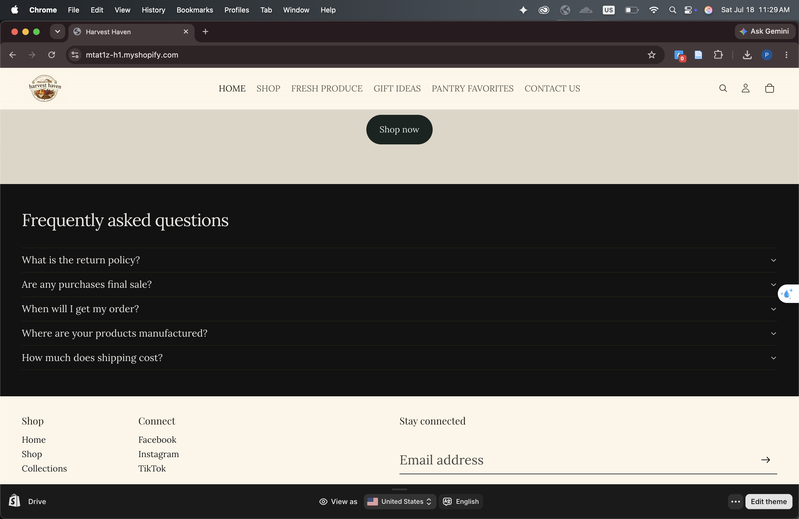
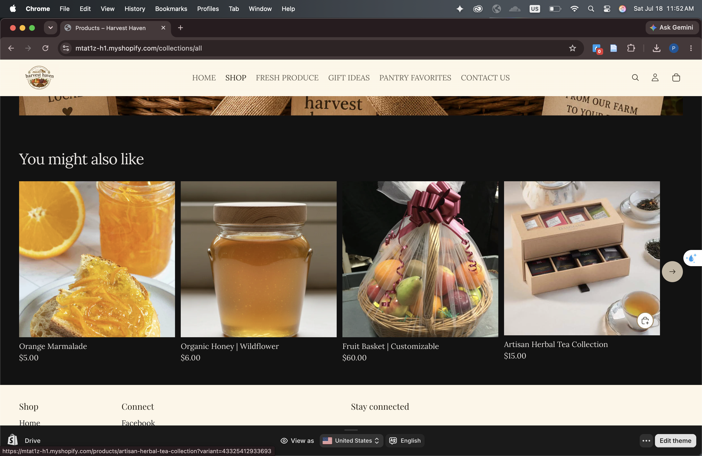

# Introduction

This report summarizes the improvements I made to the Harvest Haven Shopify storefront to create a more polished, organized, and customer-friendly shopping experience. The updates focused on improving the homepage, product pages, collection pages, and overall navigation to make it easier for customers to browse products and complete purchases.

# Homepage Improvement

## Improvements Made

-   Added a custom **Harvest Haven** logo to strengthen the store's branding. *(Figure 1.)*

-   Added **Shop Now** buttons that link customers directly to the product page. *(Figure 1.)*

-   Updated the homepage with a consistent warm beige and brown color theme to match the farm store concept. *(Figure 1.)*

-   Added a **Frequently Asked Questions (FAQ)** section to answer common customer questions. *(Figure 2.)*

-   Organized the homepage with **Shop by collection** and promotional sections to guide customers toward popular products. *(Figure 3.)*

## Screenshots

# Product Page Improvement

## Improvements Made

-   Added a **You might also like** section to recommend related products. *(Figure 4.)*

-   Added **Choose** buttons on product cards so customers can quickly add products to their cart. *(Figure 5.)*

-   Used larger, high-quality product images to better showcase each item.

## Screenshots

# Collection Page Improvement

## Improvements Made

-   Replaced the single **Collections** menu with separate navigation links for **Fresh Produce**, **Gift Ideas**, and **Pantry Favorites**. *(Header menu)*

-   Added a featured **Shop the Special Gift Baskets** section to promote the store's signature product. *(Figure 6.)*

-   Linked the featured banner directly to the Gift Basket product page for easier shopping. *(Figure 6.)*

## Screenshots

# Customer Experience Features

The three customer experience improvements I made include:

1.  **Improved navigation** by creating separate collection links in the header, making products easier to find.

2.  **Clear calls to action** by adding Shop Now buttons and Choose buttons that encourage customers to browse and purchase products.

3.  **Better homepage organization** with featured collections, a consistent color theme, and an FAQ section to improve usability and provide helpful information.

# Customer Journey ReflectionCustomer Journey Reflection

A customer visiting Harvest Haven first sees the homepage, which introduces the store with a welcoming design and clear Shop Now button. They can browse featured collections such as Fresh Produce, Gift Ideas, or Pantry Favorites using the navigation menu. After selecting a collection, customers can easily view products, read descriptions, and choose an item to purchase. The product pages also recommend related products through the "You might also like" section, encouraging customers to continue shopping before adding items to their cart and completing checkout.

# CPP Farm Store Application Reflection

The CPP Farm Store could improve its online storefront by creating a simple and organized shopping experience similar to this Shopify store. Separate collections for fresh produce, gift baskets, and pantry items would help customers quickly find products. Clear product images, consistent branding, and featured seasonal products could attract more attention and encourage purchases. Adding calls to action, related product recommendations, and helpful information such as FAQs would also improve the customer experience and make online shopping easier, especially during busy holiday seasons when gift basket sales are highest.

# Appendix

GitHub Repo:

GitHub Pages:
